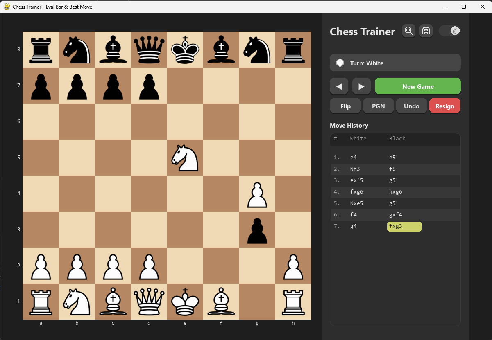

# ♟️ Chess Trainer


**Chess Trainer** คือโปรแกรมฝึกฝนหมากรุกสากลที่พัฒนาด้วยภาษา **Python** และไลบรารี **Pygame** โดยมีการเชื่อมต่อกับ **Stockfish Engine** เพื่อช่วยวิเคราะห์เกมการเล่น ทำให้ผู้เล่นสามารถเรียนรู้และพัฒนาทักษะได้ดียิ่งขึ้น

โปรเจกต์นี้จัดทำขึ้นเพื่อการศึกษา (Education Purpose) โดยเน้นการประยุกต์ใช้หลักการ OOP และการจัดการ Algorithm

---

## 🚀 ฟีเจอร์หลัก (Key Features)

| Icon | Feature | รายละเอียด |
| :---: | :--- | :--- |
| 🤖 | **Smart AI** | ระบบเล่นกับคอมพิวเตอร์ที่แยกการประมวลผล (Threading) ทำให้เกมลื่นไหล ไม่ค้าง |
| 📊 | **Evaluation Bar** | แถบแสดงคะแนนความได้เปรียบ/เสียเปรียบแบบ Real-time ช่วยให้รู้วาสถานการณ์เป็นอย่างไร |
| 💡 | **Best Move Hint** | ระบบแนะนำตาเดินที่ดีที่สุดจาก Engine เพื่อการเรียนรู้ |
| 📜 | **Move History** | บันทึกประวัติการเดินหมาก (PGN) สามารถย้อนดูเกมย้อนหลังได้ทุกตาเดิน |
| 🏰 | **Complete Rules** | รองรับกติกาหมากรุกสากลครบถ้วน: **Castling, En Passant, Promotion** |
| 🎨 | **Custom Themes** | รองรับการเปลี่ยนธีม **Light Mode** และ **Dark Mode** เพื่อความสบายตา |

---

## 💻 ตัวอย่างโปรแกรม (Screenshots)


*(รูปตัวอย่างขณะเล่นเกม)*

---

## ⚙️ การติดตั้งและใช้งาน (Installation)

1. Clone Repository
   ดึงซอร์สโค้ดลงมาที่เครื่องของคุณ:
   ```bash
   git clone https://github.com/WitsanuTun/CHESS-OOP-68.git
   cd CHESS-OOP-68
2. Install Dependencies ติดตั้ง Library ที่จำเป็น (pygame, python-chess, etc.):
   ```bash
   pip install -r requirements.txt

3. Run Application รันโปรแกรมด้วยคำสั่ง:
   ```bash
   python main.py

🎮 การควบคุม (Controls)
   🖱️Left Click: เลือกตัวหมาก / เดินหมาก
   🖱️Right Click: วาดลูกศรช่วยจำ (Annotation)
   🖱️Mouse Wheel: เลื่อนดูประวัติการเดิน (Replay)
   ⌨️Keyboard Arrow (← / →): ย้อนกลับ / ไปข้างหน้า
   

📝 License
โปรเจกต์นี้เป็นส่วนหนึ่งของรายวิชา OOP (Object Oriented Programming) จัดทำขึ้นเพื่อการศึกษา
Developed by [WitsanuKon Keprakong Ubonratchatani University]
